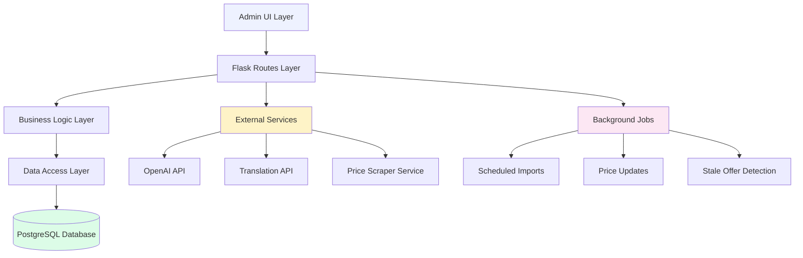
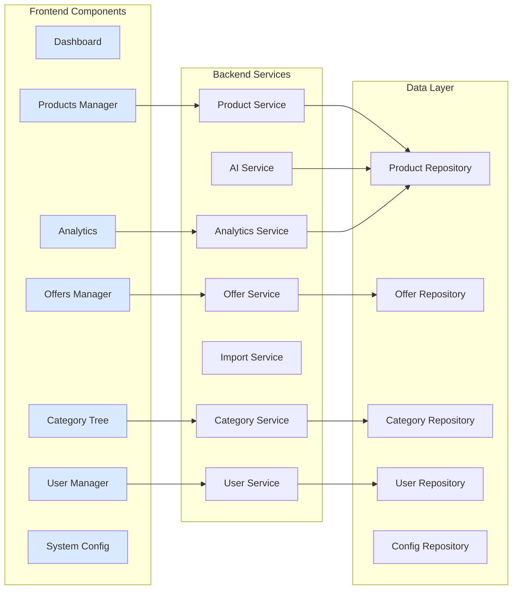
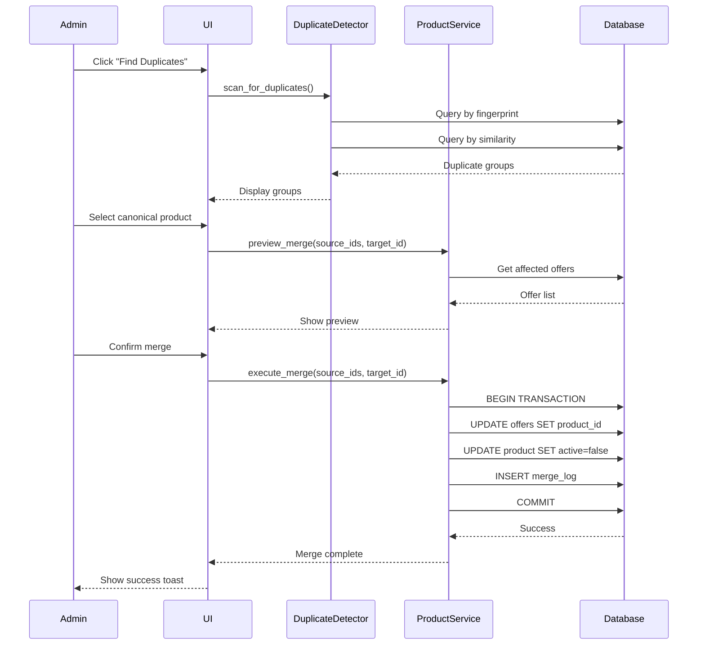
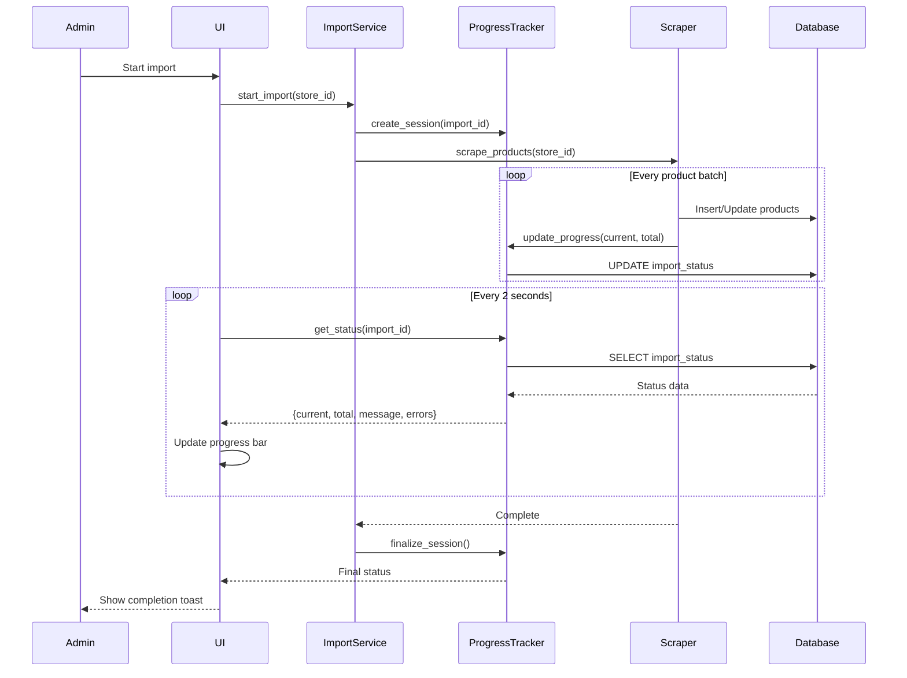
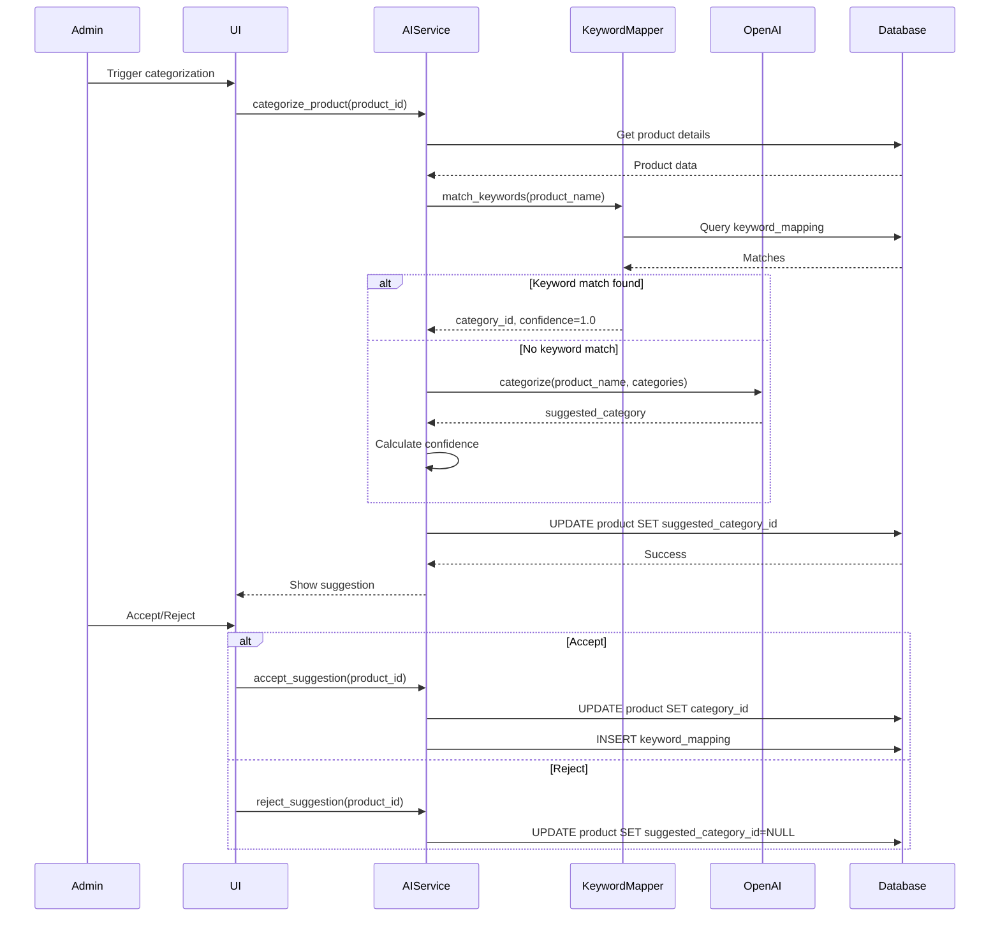

# Design Document: Admin Panel Complete Overhaul

## Overview

The Admin Panel Complete Overhaul is a comprehensive redesign and enhancement of the Smart Grocery admin panel, implementing 13 major features across 4 implementation phases. The system manages products, offers, categories, users, analytics, and system configuration for a grocery price comparison platform.

The current admin panel provides basic CRUD operations but lacks critical features like duplicate detection, bulk operations, live import tracking, and advanced analytics. This overhaul transforms it into a production-ready administrative interface with modern UX patterns, automation capabilities, and AI-powered categorization.

**Core Design Principles:**
- **Data Integrity**: Hide internal IDs/timestamps, auto-manage fingerprints and timestamps
- **User Experience**: Inline editing, bulk operations, confirmation modals, loading states, toast notifications
- **Localization**: Products use name_de (German) only; Categories use both name_de and name_en
- **Safety**: All destructive actions require confirmation with preview
- **Performance**: Pagination, lazy loading, efficient queries with proper indexing

## Architecture

### System Architecture



### Component Architecture



## Main Workflows

### Product Duplicate Detection & Merge Workflow



### Live Import Progress Tracking Workflow



### AI Categorization Workflow



## Components and Interfaces

### Component 1: Dashboard Service

**Purpose**: Aggregates metrics, recent activity, and quick actions for admin overview

**Interface**:
```python
class DashboardService:
    def get_metrics() -> DashboardMetrics:
        """
        Returns: {
            total_products: int,
            active_offers: int,
            total_stores: int,
            total_users: int,
            stale_offers: int,
            unmatched_products: int,
            pending_feedback: int
        }
        """
        pass
    
    def get_price_change_chart(days: int = 7) -> ChartData:
        """
        Returns: {
            labels: List[str],  # Date labels
            datasets: [{
                label: str,
                data: List[float],  # Average prices per day
                borderColor: str,
                backgroundColor: str
            }]
        }
        """
        pass
    
    def get_recent_imports(limit: int = 5) -> List[ImportRun]:
        """
        Returns list of recent scraper runs with status
        """
        pass
```

**Responsibilities**:
- Calculate real-time metrics from database
- Generate price change chart data for Chart.js
- Fetch recent import logs
- Provide quick action links

### Component 2: Product Service

**Purpose**: Manages product CRUD, duplicate detection, and bulk operations

**Interface**:
```python
class ProductService:
    def list_products(
        page: int,
        per_page: int,
        search: str = None,
        brand: str = None,
        category_id: int = None
    ) -> PaginatedProducts:
        """
        Returns paginated product list with filters
        """
        pass
    
    def get_product(product_id: int) -> Product:
        """
        Returns single product with all details
        """
        pass
    
    def save_product(data: ProductData) -> Product:
        """
        Creates or updates product
        Auto-calculates fingerprint from name_de + unit + size
        """
        pass
    
    def delete_product(product_id: int) -> bool:
        """
        Soft delete: Sets active=false
        Cascades to offers (sets is_available=false)
        """
        pass
    
    def find_duplicates() -> List[DuplicateGroup]:
        """
        Returns groups of potential duplicates
        Uses fingerprint matching and trigram similarity
        """
        pass
    
    def preview_merge(
        source_ids: List[int],
        target_id: int
    ) -> MergePreview:
        """
        Shows what will happen in merge:
        - Offers to be moved
        - Products to be deactivated
        """
        pass
    
    def execute_merge(
        source_ids: List[int],
        target_id: int
    ) -> MergeResult:
        """
        Executes merge in transaction:
        1. Move all offers to target
        2. Deactivate source products
        3. Log merge action
        """
        pass
    
    def bulk_update_category(
        product_ids: List[int],
        category_id: int
    ) -> int:
        """
        Updates category for multiple products
        Returns count of updated products
        """
        pass
    
    def bulk_update_brand(
        product_ids: List[int],
        brand_id: str
    ) -> int:
        """
        Updates brand for multiple products
        Returns count of updated products
        """
        pass
    
    def bulk_delete(product_ids: List[int]) -> int:
        """
        Soft deletes multiple products
        Returns count of deleted products
        """
        pass
```

**Responsibilities**:
- Product CRUD operations
- Fingerprint calculation and management
- Duplicate detection using fingerprint and similarity
- Merge operations with transaction safety
- Bulk operations for efficiency
- Validation and error handling

### Component 3: Offer Service

**Purpose**: Manages store-specific product offers and pricing

**Interface**:
```python
class OfferService:
    def list_offers(
        page: int,
        per_page: int,
        store_id: str = None,
        stale_only: bool = False
    ) -> PaginatedOffers:
        """
        Returns paginated offer list with filters
        stale_only: last_seen > 3 days ago
        """
        pass
    
    def get_offers_for_product(product_id: int) -> List[Offer]:
        """
        Returns all offers for a specific product
        """
        pass
    
    def save_offer(data: OfferData) -> Offer:
        """
        Creates or updates offer
        Auto-updates last_seen timestamp
        """
        pass
    
    def delete_offer(offer_id: int) -> bool:
        """
        Hard delete offer
        """
        pass
    
    def detect_stale_offers(days: int = 3) -> List[Offer]:
        """
        Returns offers not seen in X days
        """
        pass
    
    def bulk_update_availability(
        offer_ids: List[int],
        is_available: bool
    ) -> int:
        """
        Updates availability for multiple offers
        """
        pass
    
    def bulk_delete(offer_ids: List[int]) -> int:
        """
        Deletes multiple offers
        """
        pass
```

**Responsibilities**:
- Offer CRUD operations
- Stale offer detection
- Bulk availability updates
- Price history tracking
- Validation and error handling

### Component 4: Category Service

**Purpose**: Manages hierarchical category structure with drag-drop reordering

**Interface**:
```python
class CategoryService:
    def get_category_tree() -> List[CategoryNode]:
        """
        Returns hierarchical category tree
        Each node: {id, name_de, name_en, slug, parent_id, children[]}
        """
        pass
    
    def get_category(category_id: int) -> Category:
        """
        Returns single category with full path
        """
        pass
    
    def save_category(data: CategoryData) -> Category:
        """
        Creates or updates category
        Auto-translates name_de <-> name_en if one is missing
        """
        pass
    
    def delete_category(category_id: int) -> bool:
        """
        Deletes category if no products assigned
        """
        pass
    
    def reorder_categories(
        category_id: int,
        new_parent_id: int,
        new_position: int
    ) -> bool:
        """
        Updates category hierarchy after drag-drop
        Recalculates paths and levels
        """
        pass
    
    def bulk_assign_products(
        category_id: int,
        product_ids: List[int]
    ) -> int:
        """
        Assigns multiple products to category
        """
        pass
```

**Responsibilities**:
- Category CRUD operations
- Tree structure management
- Drag-drop reordering
- Path and level calculation
- Translation management
- Bulk product assignment

### Component 5: Import Service

**Purpose**: Manages automated price imports with live progress tracking

**Interface**:
```python
class ImportService:
    def start_import(
        store_id: str,
        import_type: str = 'full'
    ) -> str:
        """
        Starts import job
        Returns import_id for tracking
        """
        pass
    
    def get_import_status(import_id: str) -> ImportStatus:
        """
        Returns: {
            status: 'running' | 'complete' | 'failed',
            current: int,
            total: int,
            message: str,
            errors: List[str],
            started_at: datetime,
            completed_at: datetime
        }
        """
        pass
    
    def get_import_history(limit: int = 20) -> List[ImportRun]:
        """
        Returns recent import runs
        """
        pass
    
    def schedule_import(
        store_id: str,
        cron_expression: str
    ) -> bool:
        """
        Schedules recurring import
        """
        pass
    
    def cancel_import(import_id: str) -> bool:
        """
        Cancels running import
        """
        pass
```

**Responsibilities**:
- Import job orchestration
- Progress tracking and reporting
- Error handling and logging
- Scheduled import management
- Data validation

### Component 6: User Service

**Purpose**: Manages user accounts and roles

**Interface**:
```python
class UserService:
    def list_users(
        page: int,
        per_page: int,
        search: str = None,
        role: str = None
    ) -> PaginatedUsers:
        """
        Returns paginated user list
        """
        pass
    
    def get_user(user_id: int) -> User:
        """
        Returns single user with details
        """
        pass
    
    def save_user(data: UserData) -> User:
        """
        Creates or updates user
        Hashes password if provided
        """
        pass
    
    def delete_user(user_id: int) -> bool:
        """
        Soft delete user
        """
        pass
    
    def reset_password(user_id: int) -> str:
        """
        Generates temporary password
        Returns new password
        """
        pass
    
    def toggle_admin(user_id: int) -> bool:
        """
        Toggles admin role
        """
        pass
    
    def block_user(user_id: int, blocked: bool) -> bool:
        """
        Blocks/unblocks user
        """
        pass
```

**Responsibilities**:
- User CRUD operations
- Password management
- Role management
- User blocking/unblocking
- Validation and security

### Component 7: AI Categorization Service

**Purpose**: Provides AI-powered product categorization

**Interface**:
```python
class AICategorization Service:
    def categorize_product(product_id: int) -> CategorySuggestion:
        """
        Returns: {
            suggested_category_id: int,
            confidence: float,
            method: 'keyword' | 'ai'
        }
        """
        pass
    
    def accept_suggestion(product_id: int) -> bool:
        """
        Applies suggested category
        Updates keyword mapping if confidence high
        """
        pass
    
    def reject_suggestion(product_id: int) -> bool:
        """
        Clears suggestion
        """
        pass
    
    def get_keyword_mappings() -> List[KeywordMapping]:
        """
        Returns all keyword->category mappings
        """
        pass
    
    def save_keyword_mapping(
        keyword: str,
        category_id: int,
        confidence: float = 1.0
    ) -> KeywordMapping:
        """
        Creates or updates keyword mapping
        """
        pass
    
    def delete_keyword_mapping(mapping_id: int) -> bool:
        """
        Deletes keyword mapping
        """
        pass
    
    def get_review_queue(limit: int = 50) -> List[Product]:
        """
        Returns products with pending suggestions
        """
        pass
```

**Responsibilities**:
- Keyword-based categorization
- OpenAI API integration
- Confidence scoring
- Keyword mapping management
- Review queue management

## Data Models

### Product Model

```python
class Product:
    id: int  # Primary key (hidden from UI)
    fingerprint: str  # Auto-calculated: hash(name_de + unit + size)
    name_de: str  # German name (primary, editable)
    brand: str  # Brand name (not brand_id)
    category_id: int  # Foreign key to categories
    store_id: str  # Original store
    unit_normalized: str  # e.g., "L", "kg", "g"
    size_normalized: Decimal  # e.g., 1.0, 0.5
    default_image_url: str
    barcode: str  # EAN/UPC
    active: bool  # Soft delete flag
    suggested_category_id: int  # AI suggestion
    suggestion_confidence: Decimal  # 0.0-1.0
    created_at: datetime  # Auto-managed
    updated_at: datetime  # Auto-managed
    
    # Relationships
    offers: List[Offer]
    category: Category
```

**Validation Rules**:
- name_de: Required, max 255 chars
- fingerprint: Auto-calculated, unique
- unit_normalized: Must be valid unit
- size_normalized: Must be positive
- barcode: Optional, numeric, 8-13 digits
- active: Defaults to true
- timestamps: Auto-managed by database

### Offer Model

```python
class Offer:
    id: int  # Primary key (hidden from UI)
    product_id: int  # Foreign key to products
    store_id: str  # Foreign key to stores
    price: Decimal  # Current price
    product_url: str  # Store product page
    is_available: bool  # In stock flag
    last_seen: datetime  # Last scrape timestamp
    created_at: datetime  # Auto-managed
    updated_at: datetime  # Auto-managed
    
    # Relationships
    product: Product
    store: Store
    price_history: List[PriceHistory]
```

**Validation Rules**:
- product_id: Required, must exist
- store_id: Required, must exist
- price: Required, must be positive
- product_url: Required, valid URL
- is_available: Defaults to true
- last_seen: Auto-updated on scrape

### Category Model

```python
class Category:
    id: int  # Primary key (hidden from UI)
    slug: str  # URL-friendly identifier
    name_en: str  # English name (from translation file)
    name_de: str  # German name (editable)
    parent_id: int  # Self-referential foreign key
    level: int  # Depth in tree (0=root)
    icon: str  # Bootstrap icon class
    image_url: str
    
    # Relationships
    parent: Category
    children: List[Category]
    products: List[Product]
```

**Validation Rules**:
- slug: Required, unique, lowercase, alphanumeric + hyphens
- name_de: Required, max 100 chars
- name_en: Auto-translated if missing
- parent_id: Optional, must exist if provided
- level: Auto-calculated from parent

### User Model

```python
class User:
    id: int  # Primary key
    user_id: str  # Public identifier
    email: str  # Unique, required
    password_hash: str  # Bcrypt hash
    name: str
    avatar: str  # URL
    language: str  # 'en' or 'de'
    is_admin: bool  # Admin role flag
    is_blocked: bool  # Block flag
    created_at: datetime
    updated_at: datetime
    
    # Relationships
    shopping_lists: List[ShoppingList]
    favorites: List[Favorite]
```

**Validation Rules**:
- email: Required, unique, valid email format
- password_hash: Never exposed in API
- language: Must be 'en' or 'de'
- is_admin: Defaults to false
- is_blocked: Defaults to false

### ImportRun Model

```python
class ImportRun:
    id: int  # Primary key
    import_id: str  # Public identifier
    store_id: str  # Store being imported
    status: str  # 'running', 'complete', 'failed'
    current: int  # Products processed
    total: int  # Total products
    message: str  # Status message
    errors: List[str]  # Error messages (JSON)
    started_at: datetime
    completed_at: datetime
```

**Validation Rules**:
- import_id: Required, unique
- store_id: Required, must exist
- status: Must be valid enum value
- current: Must be <= total
- total: Must be positive

### KeywordMapping Model

```python
class KeywordMapping:
    id: int  # Primary key
    keyword: str  # Search keyword
    category_id: int  # Target category
    confidence: Decimal  # 0.0-1.0
    created_at: datetime
    
    # Relationships
    category: Category
```

**Validation Rules**:
- keyword: Required, lowercase, max 100 chars
- category_id: Required, must exist
- confidence: Must be 0.0-1.0

### SystemConfig Model

```python
class SystemConfig:
    id: int  # Primary key
    key: str  # Config key (unique)
    value: str  # Config value (JSON)
    value_type: str  # 'string', 'int', 'bool', 'json'
    description: str
    updated_at: datetime
```

**Validation Rules**:
- key: Required, unique, alphanumeric + underscores
- value: Required
- value_type: Must be valid enum value

## Error Handling

### Error Scenario 1: Duplicate Product Creation

**Condition**: Admin attempts to create product with existing fingerprint
**Response**: Show error toast "Product already exists with this name and size"
**Recovery**: Suggest viewing existing product or using merge tool

### Error Scenario 2: Category Deletion with Products

**Condition**: Admin attempts to delete category with assigned products
**Response**: Show error modal "Cannot delete category with X products assigned"
**Recovery**: Offer to reassign products to different category first

### Error Scenario 3: Import Failure

**Condition**: Price import fails due to network error or invalid data
**Response**: Mark import as 'failed', log errors, send notification
**Recovery**: Allow manual retry, show error details for debugging

### Error Scenario 4: Merge Conflict

**Condition**: Merge operation fails mid-transaction
**Response**: Rollback transaction, show error toast
**Recovery**: Log error details, allow retry after investigation

### Error Scenario 5: AI Categorization Timeout

**Condition**: OpenAI API times out or returns error
**Response**: Fall back to keyword matching, log error
**Recovery**: Queue for retry, allow manual categorization

## Testing Strategy

### Unit Testing Approach

**Test Coverage Goals**: 80% code coverage minimum

**Key Test Cases**:
1. **Product Service**:
   - Fingerprint calculation correctness
   - Duplicate detection accuracy
   - Merge operation atomicity
   - Bulk operation efficiency

2. **Offer Service**:
   - Stale offer detection logic
   - Price history tracking
   - Availability updates

3. **Category Service**:
   - Tree structure integrity
   - Path calculation correctness
   - Reordering logic

4. **Import Service**:
   - Progress tracking accuracy
   - Error handling
   - Transaction rollback

5. **AI Service**:
   - Keyword matching logic
   - Confidence scoring
   - Fallback behavior

### Integration Testing Approach

**Test Scenarios**:
1. **End-to-End Product Management**:
   - Create product → Add offers → Update prices → View history

2. **Import Workflow**:
   - Start import → Track progress → Verify data → Check errors

3. **Duplicate Merge**:
   - Detect duplicates → Preview merge → Execute → Verify offers moved

4. **AI Categorization**:
   - Trigger categorization → Get suggestion → Accept → Verify keyword added

5. **Bulk Operations**:
   - Select multiple products → Update category → Verify all updated

## Performance Considerations

**Database Optimization**:
- Index on `products.fingerprint` for duplicate detection
- Index on `offers.last_seen` for stale offer queries
- Index on `products.category_id` for category filtering
- Index on `products.active` for soft delete queries
- Composite index on `(product_id, store_id)` for offer lookups

**Query Optimization**:
- Use pagination for all list views (25 items per page)
- Lazy load offers when viewing product details
- Cache category tree (invalidate on update)
- Use database-level aggregations for metrics

**Frontend Optimization**:
- Debounce search inputs (300ms)
- Lazy load images with placeholder
- Use virtual scrolling for large lists
- Minimize DOM updates during progress tracking

**Caching Strategy**:
- Cache dashboard metrics (5 minute TTL)
- Cache category tree (1 hour TTL)
- Cache keyword mappings (1 hour TTL)
- No caching for product/offer lists (real-time data)

## Security Considerations

**Authentication & Authorization**:
- All admin routes require authentication
- Check `is_admin` flag on every request
- Session-based authentication with secure cookies
- CSRF protection on all POST/PUT/DELETE requests

**Input Validation**:
- Sanitize all user inputs
- Validate file uploads (images only, max 5MB)
- Validate URLs before storing
- Escape HTML in product names/descriptions

**SQL Injection Prevention**:
- Use SQLAlchemy ORM (parameterized queries)
- Never concatenate user input into SQL
- Validate all numeric IDs

**XSS Prevention**:
- Escape all user-generated content in templates
- Use Jinja2 auto-escaping
- Sanitize rich text inputs

**API Security**:
- Rate limit import endpoints (1 per minute)
- Rate limit AI categorization (10 per minute)
- Validate API keys for external services
- Use HTTPS for all external API calls

**Data Privacy**:
- Hash passwords with bcrypt (cost factor 12)
- Never log passwords or API keys
- Redact sensitive data in error messages
- Implement audit logging for admin actions

## Dependencies

**Backend Dependencies**:
- Flask 2.3+ (web framework)
- SQLAlchemy 2.0+ (ORM)
- psycopg2 2.9+ (PostgreSQL driver)
- openai 1.0+ (AI categorization)
- requests 2.31+ (HTTP client)
- deep-translator 1.11+ (translation fallback)
- APScheduler 3.10+ (scheduled imports)
- bcrypt 4.0+ (password hashing)

**Frontend Dependencies**:
- Tailwind CSS 3.3+ (styling)
- Chart.js 4.4+ (price change graphs)
- SortableJS 1.15+ (drag-drop category tree)
- Bootstrap Icons 1.11+ (icons)

**Database**:
- PostgreSQL 14+ (with pg_trgm extension for similarity)

**External Services**:
- OpenAI API (GPT-4 for categorization)
- LibreTranslate API (translation fallback)

**Development Tools**:
- pytest 7.4+ (testing)
- black 23.0+ (code formatting)
- flake8 6.1+ (linting)
- mypy 1.5+ (type checking)

